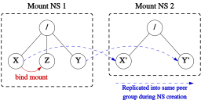

## Mount namespaces and shared subtrees

problem:

When a new disk is loaded into an optical disk drive, the only way to make that disk visible in all mount namespaces was to mount the disk separately in each namespace. In many cases, it would instead be preferable to perform a single mount operation that makes the disk visible in all (or perhaps some subset) of the mount namespaces on the system.

Because of the problem just described, the shared subtrees feature was added in Linux 2.6.15

each mount point is marked with a "propagation type", which determines whether mount points created and removed under this mount point are propagated to other mount points.

There are four different propagation types:

* MS_SHARED: This mount point shares mount and unmount events with other mount points that are members of its "peer group" (which is described in more detail below). When a mount point is added or removed under this mount point, this change will propagate to the peer group, so that the mount or unmount will also take place under each of the peer mount points. Propagation also occurs in the reverse direction, so that mount and unmount events on a peer mount will also propagate to this mount point.
* MS_PRIVATE: This is the converse of a shared mount point. The mount point does not propagate events to any peers, and does not receive propagation events from any peers.
* MS_SLAVE: This propagation type sits midway between shared and private. A slave mount has a master—a shared peer group whose members propagate mount and unmount events to the slave mount. However, the slave mount does not propagate events to the master peer group.
* MS_UNBINDABLE: This mount point is unbindable. Like a private mount point, this mount point does not propagate events to or from peers. In addition, this mount point can't be the source for a bind mount operation.

a few points: 

1. propagation type is a per-mount-point setting. Within a namespace, some mount points might be marked shared, while others are marked private.

2. propagation type determines the propagation of mount and unmount events immediately under the mount point.


```shell
mount --make-private /
mount --make-shared /dev/sda3 /X
mount --make-shared /dev/sda5 /Y
unshare -m --propagation unchanged sh
mkdir /Z
mount --bind /X /Z
```

we have the situation shown in the diagram below.


## /proc/PID/mountinfo

The /proc/PID/mountinfo file displays a range of information about the mount points for the mount namespace in which the process PID resides. 

```shell
cat /proc/self/mountinfo | sed 's/ - .*//'
    61 0 8:2 / / rw,relatime
    81 61 8:3 / /X rw,relatime shared:1
    124 61 8:5 / /Y rw,relatime shared:2
    228 61 8:3 / /Z rw,relatime shared:1
```

We also see that the mount points /X and /Z are shared mount points in the same peer group (with ID 1), which means that mount and unmount events under either of these two mounts will propagate to the other. The mount /Y is a shared mount in a different peer group (ID 2), which, by definition, does not propagate events to or from the mounts in peer group 1.