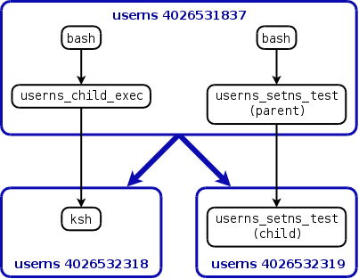

creating a user namespace requires (since Linux 3.8) no capabilities, and the first process in the namespace gains a full set of capabilities

## capabilities
* A process has a capability inside a user namespace if it is a member of the namespace and that capability is present in its effective capability set.
* If a process has a capability in a user namespace, then it has that capability in all child
* A process whose effective user ID matches that of the owner of a user namespace and which is a member of the parent namespace has all capabilities in the namespace.

